# AI 艺术设计竞赛预评审工作台｜产品说明与使用指南

> 当前文档基于项目现有代码与 `docs/product-inventory.md` 编写。本文描述的是当前 Demo 已实现能力；未完成能力统一标注为“规划中”或“未来版本”。

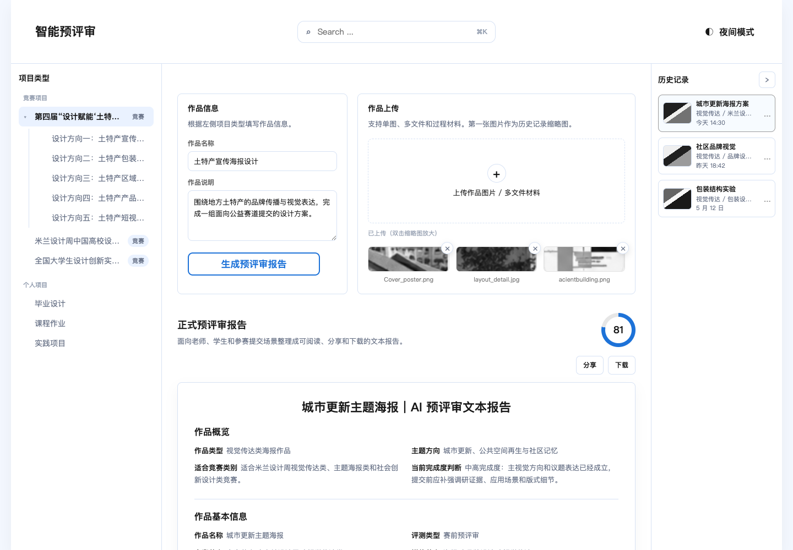

## 1. 产品简介

AI 艺术设计竞赛预评审工作台是一个面向艺术与设计作品赛前评审场景的静态前端 Demo。当前版本用于展示从项目类型选择、作品信息填写、作品材料上传、Mock AI 预评审报告生成，到历史记录管理和报告基础操作的完整演示流程。

当前产品定位不是正式在线评审系统，而是一个可用于产品沟通、设计评审、技术方案讨论和后续 API 接入验证的 MVP 原型。

当前版本具备以下边界：

- 已实现：项目类型选择、作品信息表单、多文件上传列表、缩略图预览、拖拽排序、Mock AI 报告生成、报告分享链接、Markdown 下载、打印入口、历史记录、日夜主题切换。
- 部分实现：AI 对话面板仅提供模拟回复，不连接真实模型。
- 未实现：真实大模型 API、后端服务、账号体系、云端文件存储、真实 PDF 生成、历史报告完整回访。

## 2. 目标用户与核心场景

### 目标用户

| 用户类型 | 关注点 | 当前产品如何支持 |
| --- | --- | --- |
| 老板 / 业务负责人 | 快速理解产品方向、演示 MVP 闭环、评估后续投入价值 | 通过单页面工作台展示完整预评审流程，便于汇报和决策。 |
| 产品经理 | 梳理用户路径、明确 MVP 边界、定义后续迭代范围 | 左侧分类、作品表单、报告、历史记录形成可讨论的信息架构。 |
| 设计团队 | 观察页面结构、交互状态、报告内容层级和截图需求 | 页面包含工作区、上传列表、报告面板、右侧历史栏和日夜主题。 |
| 技术团队 | 判断模块拆分、Mock 数据结构、未来 API 替换点 | 代码按 `components`、`state`、`data`、`services`、`styles` 拆分。 |
| 学生 / 参赛者 | 在提交前获得作品材料和说明文本的预评审建议 | 当前通过 Mock 报告模拟预评审结果，真实 AI 能力属于未来版本。 |

### 核心场景

1. 学生或指导老师选择竞赛项目或个人项目语境。
2. 填写作品名称、作品说明；个人项目可补充作品要求。
3. 上传作品图片、多文件材料或过程材料。
4. 生成一份结构化预评审报告。
5. 查看综合分、维度评分、优点、问题、修改建议和提交前检查清单。
6. 通过分享链接、Markdown 下载或打印入口保存报告。
7. 在右侧历史记录中查看新生成记录，并进行重命名、查看高亮或删除。

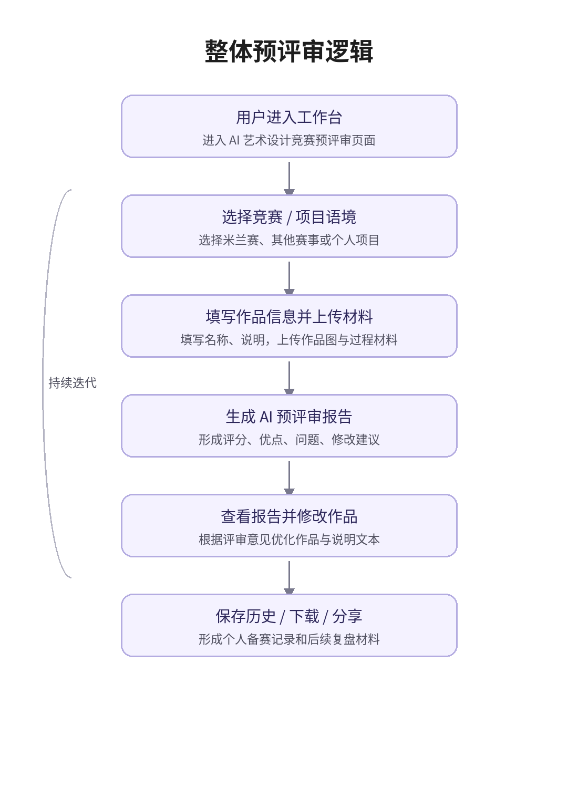

## 3. 核心能力速览

| 能力 | 当前状态 | 页面位置 | 对应代码 |
| --- | --- | --- | --- |
| 项目类型与分类导航 | 已实现 | 左侧导航栏 | `src/components/taxonomyTree.js` |
| 作品信息填写 | 已实现 | 中间工作区顶部左侧 | `src/components/workForm.js` |
| 多文件上传与缩略图列表 | 已实现 | 中间工作区顶部右侧 | `src/components/fileUpload.js`, `src/state/uploads.js` |
| 文件预览弹层 | 已实现 | 双击上传缩略图后打开 | `src/components/previewModal.js` |
| Mock AI 预评审报告 | 已实现 | 中间报告区域 | `src/components/reportPanel.js`, `src/services/aiReviewService.mock.js` |
| 报告分享 | 已实现 | 报告操作区 | `src/components/reportPanel.js` |
| Markdown 下载 | 已实现 | 报告下载菜单 | `src/components/reportPanel.js`, `src/utils/file.js` |
| 打印入口 | 已实现 | 报告下载菜单 | `src/components/reportPanel.js` |
| 历史记录 | 已实现 | 右侧历史栏 | `src/components/historyPanel.js`, `src/components/rightRail.js`, `src/state/history.js` |
| 日间 / 夜间主题 | 已实现 | 顶部栏右侧 | `src/components/topBar.js`, `src/state/theme.js` |
| AI 对话 | 部分实现 | 报告下方 | `src/components/chatPanel.js` |
| 搜索 | 仅 UI | 顶部栏中间 | `src/components/topBar.js` |
| 设置中心 | 规划中 | 当前未接入页面 | `src/components/settingsModal.js` |
| 报告目录 | 规划中 | 当前未接入页面 | `src/components/reportOutline.js` |

## 4. 5 分钟快速上手

### 步骤 1：打开工作台

本项目是 Vite 静态前端 Demo，建议通过本地开发服务器访问：

```bash
npm install
npm run dev
```

默认访问地址：

```text
http://127.0.0.1:5173/
```

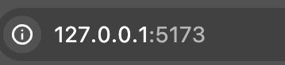

### 步骤 2：选择项目语境

在左侧“项目类型”导航中选择竞赛项目或个人项目。当前默认选中“第四届‘设计赋能土特产，助力乡村振兴’公益赛道”。

可选节点包括：

- 竞赛项目
- 公益赛道下的 5 个设计方向
- 米兰设计周中国高校设计学科师生优秀作品展
- 全国大学生设计创新实践大赛
- 个人项目：毕业设计、课程作业、实践项目

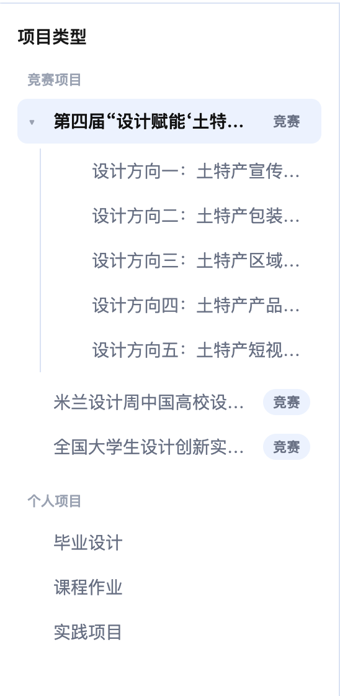

### 步骤 3：填写作品信息

在“作品信息”区域填写作品名称和作品说明。选择个人项目后，表单会额外显示“作品要求”字段。

当前表单信息会参与 Mock 报告生成，但不会上传到服务器。

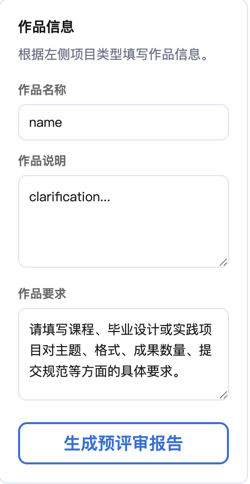

### 步骤 4：上传作品材料

在“作品上传”区域点击上传框，或把文件拖入上传区域。当前支持多文件追加：

- 图片文件会生成本地缩略图。
- 非图片文件会显示扩展名占位。
- 双击缩略图可打开预览弹层。
- 文件项可删除，也可拖拽调整顺序。

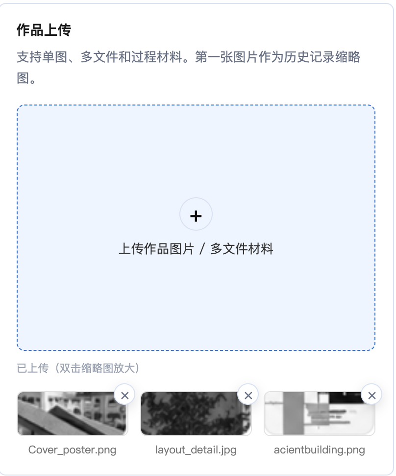

### 步骤 5：生成预评审报告

点击“生成预评审报告”。系统会基于当前表单内容和分类语境匹配 Mock 案例，生成结构化报告并更新右侧历史记录。

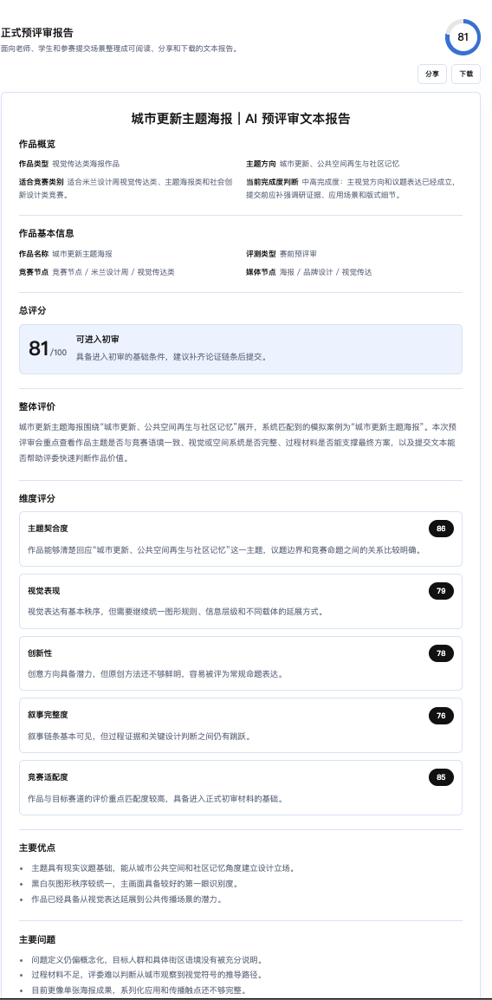

### 步骤 6：保存或分享报告

报告区域提供以下操作：

- 分享：生成带 `#formalReport` 的当前页面链接，可复制。
- 下载 Markdown：导出当前报告文本为 `ai-art-review-report.md`。
- 下载 PDF：当前实际为浏览器打印入口，是否保存为 PDF 取决于浏览器打印设置。

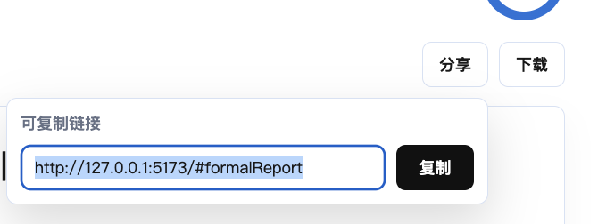

## 5. 界面总览

当前工作台采用“三栏 + 顶部栏”的布局。

```text
┌──────────────────────────────────────────────────────────────┐
│ 顶部栏：品牌标题 / 搜索输入框 / 日间夜间主题切换              │
├──────────────┬────────────────────────────────┬──────────────┤
│              │                                │              │
│ 左侧分类导航 │ 中间工作区                      │ 右侧历史记录 │
│              │ - 作品信息                      │              │
│ - 竞赛项目   │ - 作品上传                      │ - 历史列表   │
│ - 个人项目   │ - 正式预评审报告                │ - 更多菜单   │
│              │ - AI 对话                       │ - 折叠入口   │
│              │                                │              │
└──────────────┴────────────────────────────────┴──────────────┘
```

| 区域 | 功能说明 | 当前状态 |
| --- | --- | --- |
| 顶部栏 | 展示产品名称、搜索框和主题切换 | 搜索仅 UI；主题切换已实现。 |
| 左侧分类导航 | 选择竞赛项目、竞赛方向或个人项目 | 已实现。 |
| 中间工作区 | 完成作品信息填写、上传、报告阅读和 AI 对话 | 主流程已实现；AI 对话为模拟回复。 |
| 右侧历史栏 | 展示历史记录，支持折叠和更多操作 | 已实现基础操作。 |
| 预览弹层 | 双击上传文件后查看大图或文件类型占位 | 已实现。 |

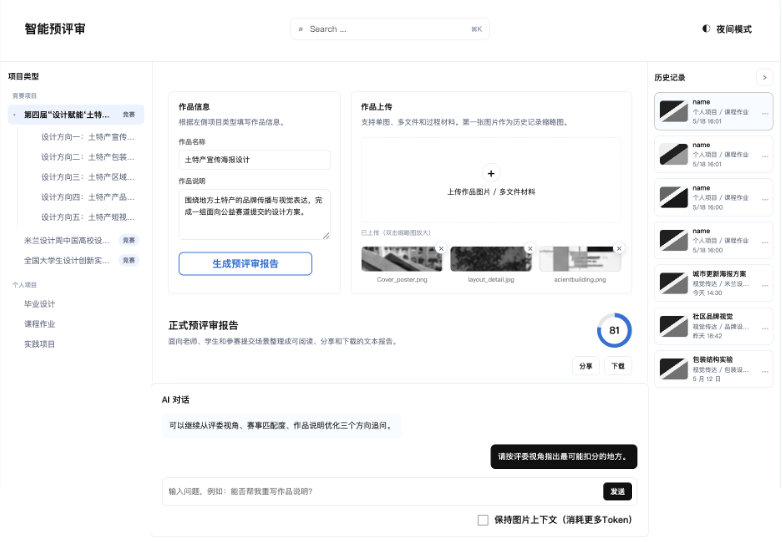

## 6. 功能模块说明

### 6.1 分类导航

分类导航用于决定本次预评审的项目语境。用户点击节点后，系统会更新当前项目类型和 breadcrumb，并通知作品信息表单切换字段。

当前实现：

- 竞赛项目与个人项目均可选。
- 带子节点的公益赛道可展开 / 折叠。
- 当前选中节点会高亮。
- 选择个人项目时，作品表单会增加“作品要求”字段。

代码对应：

- `src/components/taxonomyTree.js`
- `src/state/reviewStore.js`

规划中：

- `src/data/taxonomy.js` 当前只保留默认 breadcrumb，分类树内容仍写在组件模板中。未来版本可改为数据驱动分类树。

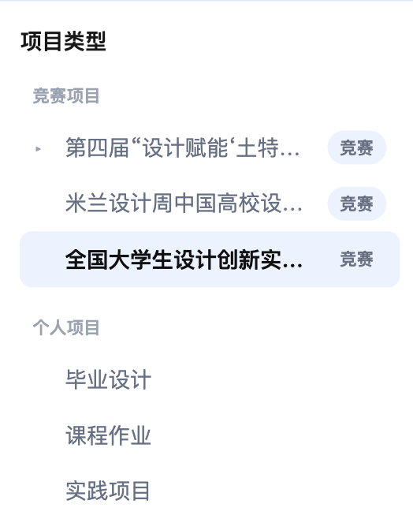

### 6.2 作品信息表单

作品信息表单用于收集生成报告所需的基础文本。

竞赛项目下包含：

- 作品名称
- 作品说明

个人项目下额外包含：

- 作品要求

点击“生成预评审报告”时，表单会把标题、说明、要求、当前项目类型和 breadcrumb 组合为 `work` 输入，传入 Mock 评审服务。

代码对应：

- `src/components/workForm.js`
- `src/services/aiReviewService.mock.js`

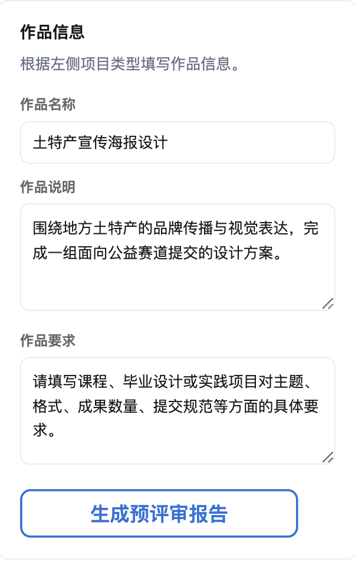

### 6.3 作品上传

作品上传模块用于模拟用户上传作品主图、多文件材料和过程材料。

当前实现：

- 初始展示 3 个示例文件。
- 支持点击选择文件。
- 支持拖拽文件到上传区域。
- 支持多文件追加。
- 图片文件生成浏览器本地 `blob:` 预览地址。
- 非图片文件显示扩展名占位。
- 文件支持删除。
- 文件列表支持拖拽排序。

代码对应：

- `src/components/fileUpload.js`
- `src/state/uploads.js`
- `src/data/seedFiles.js`

注意：

- 当前上传文件只保存在浏览器运行时内存中，刷新页面后会回到默认示例文件。
- README 和界面文案提到“第一张图片作为历史记录缩略图”，但当前历史记录卡片仍使用 CSS 渐变占位；该能力待确认。

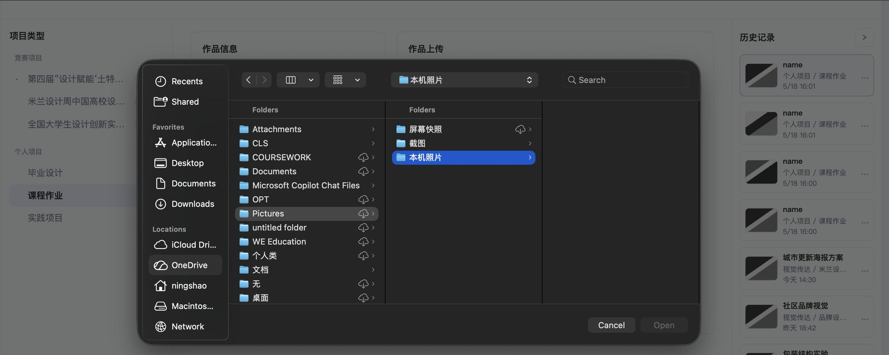

### 6.4 文件预览

用户双击上传列表中的文件缩略图后，会打开预览弹层。

当前实现：

- 图片：显示大图。
- 非图片：显示扩展名大号占位。
- 支持关闭按钮、点击遮罩、Esc 关闭。

代码对应：

- `src/components/previewModal.js`
- `src/state/uploads.js`

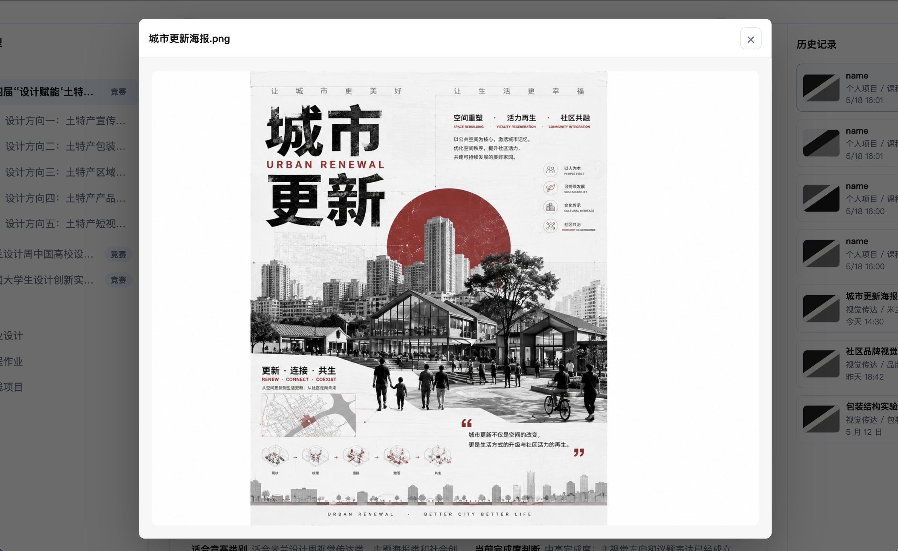

### 6.5 报告操作

报告操作位于“正式预评审报告”上方。

当前实现：

- 分享：生成当前页面链接，并把 hash 设置为 `#formalReport`。
- 复制：调用浏览器剪贴板 API 复制链接。
- 下载 Markdown：把当前报告 DOM 文本整理为 Markdown 并下载。
- 下载 PDF：调用 `window.print()` 打开浏览器打印流程。

代码对应：

- `src/components/reportPanel.js`
- `src/utils/file.js`

注意：

- 当前没有程序化生成 PDF 文件。“下载 PDF”实际是打印入口，用户可在浏览器打印面板中选择“另存为 PDF”。

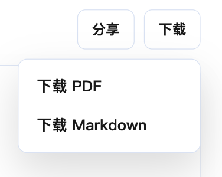

### 6.6 历史记录

历史记录位于右侧栏，用于展示最近评审记录。

当前实现：

- 初始展示 3 条静态历史记录。
- 新生成报告会创建一条新历史记录并插入列表顶部。
- 新生成记录会写入 `localStorage`。
- 更多菜单支持重命名、查看、删除。
- 右侧栏支持折叠和展开。

代码对应：

- `src/components/historyPanel.js`
- `src/components/rightRail.js`
- `src/state/history.js`
- `src/services/storageService.js`

注意：

- 当前“查看”只切换高亮状态，不会把旧报告重新加载到报告面板。
- 静态历史记录不在 store 中，刷新后会恢复为模板状态。
- 新生成历史记录最多保留 12 条。

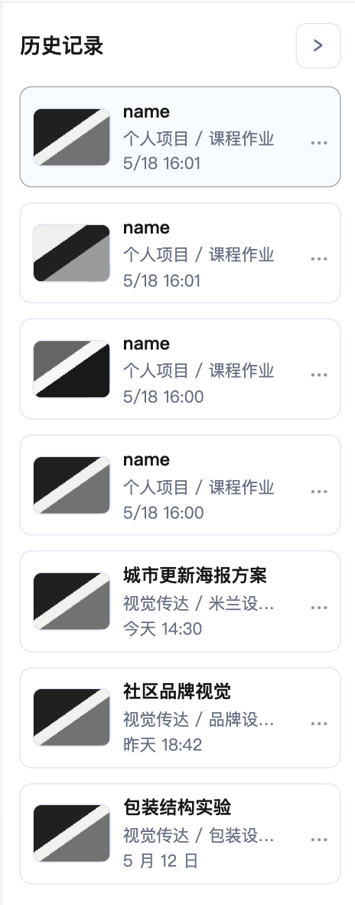

### 6.7 AI 对话

AI 对话面板位于报告下方，用于模拟用户基于报告继续追问。

当前实现：

- 页面初始展示一条 AI 消息和一条用户消息。
- 用户输入问题并发送后，页面会追加用户消息。
- 系统追加固定模拟回复：“已收到问题。当前版本先保留模拟对话，后续会接入真实 AI 评审服务。”
- “保持图片上下文”复选框当前只展示 UI，没有参与请求逻辑。

代码对应：

- `src/components/chatPanel.js`

未来版本：

- 接入真实 AI 对话能力。
- 结合当前报告、作品说明和上传材料进行追问。
- 明确图片上下文开关对 Token、成本和隐私的影响。

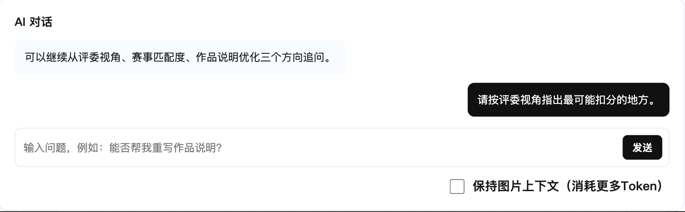

### 6.8 主题切换

顶部栏提供日间 / 夜间主题切换。

当前实现：

- 点击按钮切换 `body[data-theme]`。
- 主题偏好写入 `localStorage`。
- 刷新后读取本地主题偏好。

代码对应：

- `src/components/topBar.js`
- `src/state/theme.js`
- `src/services/storageService.js`
- `src/styles/tokens.css`

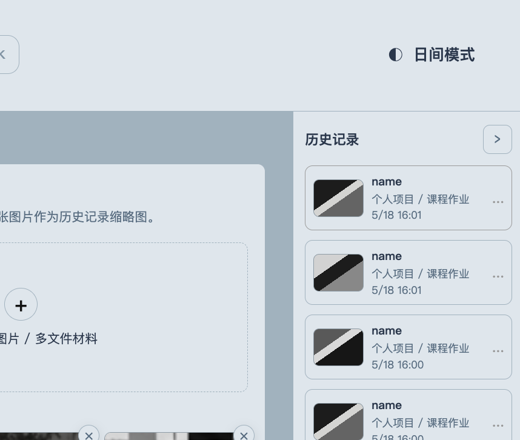

### 6.9 搜索、设置与报告目录

以下能力当前不是已完成业务功能：

| 功能 | 当前状态 | 说明 |
| --- | --- | --- |
| 顶部搜索 | 仅 UI | 输入框存在，但没有搜索事件和结果展示。 |
| 设置中心 | 规划中 | `settingsModal.js` 和样式存在，但当前未接入入口和绑定。 |
| 报告目录 | 规划中 | `reportOutline.js` 已写滚动同步逻辑，但当前未渲染到页面。 |

这些能力可作为后续产品化迭代候选项。

## 7. AI 预评审报告说明

当前报告以“正式预评审报告”的形式展示，面向老师、学生和参赛提交场景组织内容。

报告结构包括：

| 报告部分 | 说明 |
| --- | --- |
| 作品概览 | 展示作品类型、主题方向、适合竞赛类别和完成度判断。 |
| 作品基本信息 | 展示作品名称、评测类型、竞赛节点和媒体节点。 |
| 总评分 | 展示总分、等级和总体建议。 |
| 整体评价 | 从主题、竞赛语境、材料完整度和评审阅读路径进行整体描述。 |
| 维度评分 | 展示 5 个评分维度的分数和解释。 |
| 主要优点 | 列出作品当前优势。 |
| 主要问题 | 列出最需要修正的问题。 |
| 修改建议 | 给出可执行的改进方向。 |
| 提交前检查清单 | 提醒提交前检查信息一致性、材料规格、错别字等。 |
| 参赛方向匹配度 | 说明作品与当前赛道或类别的匹配关系。 |
| 总结 | 汇总当前作品最关键的提升方向。 |

当前评分维度：

- 主题契合度
- 视觉表现
- 创新性
- 叙事完整度
- 竞赛适配度

当前等级规则：

| 分数区间 | 等级 |
| --- | --- |
| 88 分及以上 | 优秀 |
| 76 分及以上 | 可进入初审 |
| 62 分及以上 | 需要明显修改 |
| 0 分及以上 | 不建议直接提交 |

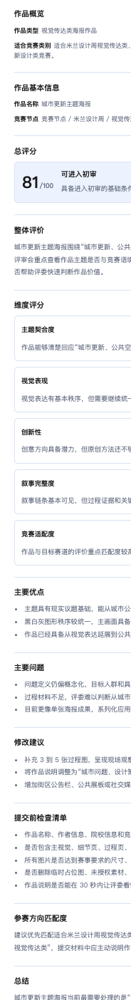

## 8. 当前 Mock AI 逻辑说明

当前项目没有真实网络请求，也没有真实大模型调用。点击“生成预评审报告”后，前端完全基于本地 Mock 数据生成报告。

### 数据来源

Mock 数据分为三层：

| 数据文件 | 作用 |
| --- | --- |
| `src/data/mockCases.js` | 维护 5 个模拟作品案例，包括主题、类别、优缺点、建议和基础评分。 |
| `src/data/reviewRubrics.js` | 维护评分维度、等级规则、分数裁剪和总分计算。 |
| `src/data/mockReport.js` | 根据当前输入、匹配案例和评分规则组装正式报告。 |

### 生成流程

```text
作品表单输入 + 当前分类语境
  -> generateMockReview(work)
  -> buildMockReport(work)
  -> findBestMockCase(work)
  -> normalizeWork(workInput, mockCase)
  -> tuneScoreProfile(mockCase, work)
  -> getTotalScore(scoreProfile)
  -> getScoreLevel(totalScore)
  -> 返回结构化 report
```

### 匹配逻辑

当前 `findBestMockCase(work)` 会：

1. 优先使用显式 `caseId`。
2. 如果没有 `caseId`，把作品标题、分类、赛道、主题、描述、breadcrumb、mediaNode 拼成文本。
3. 与 Mock 案例中的标题、类别、主题、赛道、作品类型、媒体节点等关键词做匹配。
4. 匹配不到时回退到默认案例 `urban-renewal-poster`。

### 分数调整逻辑

当前分数不是模型评分，而是基于 Mock 案例的基础评分做轻量调整：

- 作品说明较长时略微加分。
- 作品说明过短时扣分。
- 叙事维度会受说明长度影响。
- 竞赛适配维度会受竞赛节点信息影响。
- 视觉表现维度会受媒体节点变化影响。

### 重要限制

- 当前报告内容不可视为真实 AI 判断。
- 当前上传图片不会被模型识别或分析。
- 当前 AI 对话不会读取报告上下文。
- 当前没有后端、没有 API key、没有真实模型服务。

## 9. 后续接入真实大模型 API 的技术结构

真实大模型 API 不应直接写在前端，也不应把 API key 放入浏览器代码、前端环境变量或静态托管产物。

建议未来版本采用“静态前端 + 后端代理”的结构：

```text
浏览器静态前端
  -> POST /api/reviews
后端代理 / Serverless Function
  -> 读取服务端环境变量中的 API key
  -> 校验、裁剪、脱敏前端输入
  -> 调用真实大模型 API
  -> 返回结构化评审结果
前端报告面板
  -> 渲染真实评审结果
  -> 写入历史记录
```


### 前端改造点

| 当前模块 | 未来版本改造方向 |
| --- | --- |
| `src/services/aiReviewService.mock.js` | 替换为调用 `/api/reviews` 的真实 service，或新增真实 service 后按环境切换。 |
| `src/data/mockCases.js` | 保留为 Demo / fallback 数据，不再作为正式评分来源。 |
| `src/data/mockReport.js` | 可保留报告结构适配层，负责把 API 返回结果规范化为前端 report。 |
| `src/components/workForm.js` | 增加 loading、错误态、重试和禁用状态。 |
| `src/components/fileUpload.js` | 明确文件上传策略：仅传元数据、传图片 base64、传对象存储 URL，或由后端处理文件。 |
| `src/components/chatPanel.js` | 接入对话 API，并决定是否携带报告和图片上下文。 |

### 后端职责

未来后端代理至少需要负责：

- 读取服务端 API key。
- 校验作品标题、说明、项目类型、上传材料元数据等输入。
- 控制文本长度、图片数量和单次请求成本。
- 调用真实模型 API。
- 返回稳定的结构化 JSON。
- 处理错误、超时、重试和日志脱敏。
- 做基础速率限制，避免 Demo 被滥用。

## 10. MVP 范围与暂不包含内容

### 当前 MVP 范围

| 范围 | 当前状态 |
| --- | --- |
| 单页工作台 | 已实现 |
| 竞赛 / 个人项目语境选择 | 已实现 |
| 作品信息表单 | 已实现 |
| 示例文件和本地文件上传列表 | 已实现 |
| 图片和非图片预览 | 已实现 |
| Mock AI 报告生成 | 已实现 |
| 报告展示、分享、Markdown 下载、打印入口 | 已实现 |
| 本地历史记录 | 已实现 |
| 日夜主题切换 | 已实现 |

### 暂不包含内容

| 能力 | 状态 |
| --- | --- |
| 真实大模型评审 | 未来版本 |
| 后端服务与数据库 | 未来版本 |
| 用户登录 / 退出 | 规划中；当前设置弹层未接入 |
| 云端文件存储 | 未来版本 |
| 图片内容真实识别 | 未来版本 |
| 历史报告完整回访 | 规划中 |
| 程序化 PDF 生成 | 规划中 |
| 搜索结果与全局检索 | 规划中 |
| 多语言切换 | 规划中；当前仅设置弹层文案中出现 |
| 团队协作、权限管理、评论批注 | 未来版本 |

## 11. Roadmap

### V0.1 当前版本：静态 Mock Demo

- 完成单页工作台。
- 跑通分类选择、作品信息、上传、Mock 报告、历史记录闭环。
- 支持基础报告操作和本地主题持久化。

### V0.2 产品化补齐：增强前端闭环

规划中：

- 接入报告目录组件。
- 接入设置中心入口，但仅开放真实可用配置项。
- 优化历史记录查看能力，支持回填旧报告。
- 明确历史记录缩略图是否使用上传列表第一张图片。
- 增加生成报告时的 loading、错误态和空状态。
- 将分类树从组件硬编码逐步迁移到数据配置。

### V0.3 API 接入：真实模型评审

未来版本：

- 新增 `/api/reviews` 后端代理。
- 将 Mock service 替换为真实评审 service。
- 设计结构化评审结果 schema。
- 增加输入校验、请求失败处理和成本控制。
- 明确上传文件在模型请求中的处理方式。

### V0.4 持久化与团队使用

未来版本：

- 增加用户身份或轻量项目空间。
- 保存完整报告、上传材料元数据和历史版本。
- 支持报告导出 PDF 文件。
- 支持更完整的检索、筛选和管理能力。

## 12. FAQ

### Q1：当前版本是否已经接入真实 AI？

没有。当前版本使用本地 Mock 数据生成报告，不会发起真实网络请求，也不会调用真实大模型 API。

### Q2：上传的图片会被 AI 分析吗？

不会。当前上传图片只用于前端缩略图和预览展示。Mock 报告生成逻辑不会读取图片内容。

### Q3：为什么点击“下载 PDF”后打开的是打印窗口？

当前“下载 PDF”实际调用 `window.print()`。是否保存为 PDF 取决于浏览器打印面板。程序化 PDF 导出属于规划中能力。

### Q4：历史记录会一直保存吗？

不会。当前新生成的历史记录保存在当前浏览器的 `localStorage` 中，最多保留 12 条。清除站点数据后会丢失。初始 3 条历史记录是静态模板记录。

### Q5：历史记录的“查看”会恢复旧报告吗？

当前不会。当前“查看”只切换历史卡片的 active 样式。完整报告回访属于规划中能力。

### Q6：顶部搜索框可以搜索报告或历史记录吗？

当前不可以。搜索框只有 UI，没有绑定搜索逻辑。

### Q7：设置中心可以使用吗？

当前不可以。项目中存在 `settingsModal.js` 和对应样式，但页面没有渲染入口，也没有业务逻辑。该功能属于规划中。

### Q8：报告分数是如何得出的？

当前分数来自 Mock 案例的 `scoreProfile`，再根据文本长度和节点信息做轻量调整，最后对 5 个维度取平均。它不是真实模型评分。

### Q9：这个项目是否需要后端才能运行？

当前 Demo 不需要后端，只需要 Vite 本地开发服务器或静态部署环境。未来接入真实模型 API 时需要后端代理。

### Q10：是否可以直接部署到静态平台？

可以。项目使用 Vite 构建，`vite.config.js` 设置了 `base: './'`，适合部署到 GitHub Pages、Vercel、Netlify 或 Cloudflare Pages 等静态托管平台。

## 13. 截图清单与插图占位

以下截图建议补齐到 `docs/assets/screenshots/`，用于产品汇报、设计评审和技术沟通。

| 截图 | 建议文件名 | 用途 |
| --- | --- | --- |
| 产品首页总览 | `home-overview.png` | 展示整体工作台。 |
| 核心使用场景 | `core-scenario.png` | 展示从选择语境到生成报告的业务闭环。 |
| 本地运行首页 | `dev-home.png` | 说明 Demo 启动后的默认状态。 |
| 分类导航选择 | `taxonomy-select.png` | 展示左侧竞赛和个人项目节点。 |
| 作品信息表单 | `work-form.png` | 展示竞赛项目表单。 |
| 个人项目表单状态 | `personal-work-form.png` | 展示额外“作品要求”字段。 |
| 作品材料上传 | `file-upload.png` | 展示上传区域和示例文件。 |
| 上传文件列表 | `upload-list.png` | 展示多文件、删除和排序状态。 |
| 文件预览弹层 | `file-preview-modal.png` | 展示双击缩略图后的预览。 |
| 生成预评审报告 | `generate-report.png` | 展示点击生成后的报告状态。 |
| 报告内容结构 | `report-structure.png` | 展示报告章节和评分。 |
| 报告操作菜单 | `report-actions.png` | 展示分享和下载入口。 |
| 报告分享面板 | `report-share-panel.png` | 展示可复制链接。 |
| AI 对话面板 | `chat-panel.png` | 展示模拟对话和图片上下文开关。 |
| 右侧历史记录 | `history-panel.png` | 展示历史列表和更多菜单。 |
| 夜间主题 | `night-theme.png` | 展示主题切换后的界面。 |
| 界面区域说明 | `interface-overview.png` | 标注顶部栏、左栏、中区、右栏。 |
| 真实模型接入架构 | `api-architecture.png` | 展示未来 API 代理结构。 |

插图占位汇总：


